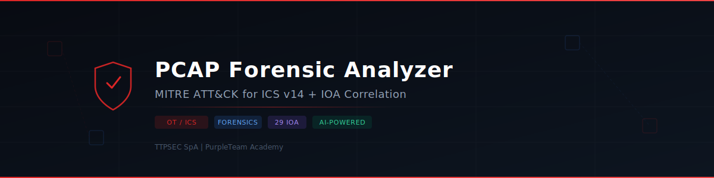
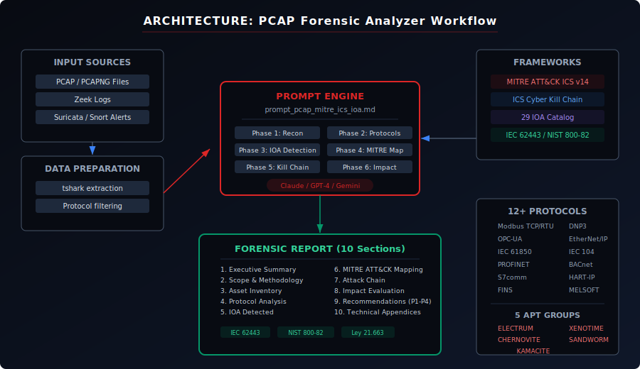

<div align="center">

<picture>
  <source media="(prefers-color-scheme: dark)" srcset="assets/banner-dark.svg" />
  <source media="(prefers-color-scheme: light)" srcset="assets/banner-dark.svg" />
  
</picture>

<br />

[](https://creativecommons.org/licenses/by-sa/4.0/)
[](CHANGELOG.md)
[](https://attack.mitre.org/matrices/ics/)
[](https://www.iec.ch/cyber-security)
[](https://csrc.nist.gov/pubs/sp/800/82/r3/final)
[](https://www.bcn.cl/leychile/navegar?idNorma=1202434)
[](https://github.com/ttpsecspa/pcap-forensic-mitre-ics-ioa/actions/workflows/ci.yml)

**Un prompt de ingenieria avanzada que transforma cualquier LLM en un analista forense senior de trafico de red OT/ICS, generando informes completos con mapeo MITRE ATT&CK for ICS y correlacion de Indicadores de Ataque (IOA).**

[Prompt Completo](#-prompt-completo) · [Catalogo IOA](#-catalogo-de-indicadores-de-ataque-ioa) · [Uso Rapido](#-uso-rapido) · [Arquitectura](#-arquitectura) · [Contribuir](#-contribuir)

</div>

---

## Tabla de Contenidos

- [Que es esto](#-que-es-esto)
- [Por que es diferente](#-por-que-es-diferente)
- [Uso Rapido](#-uso-rapido)
- [Preparacion de Datos](#-preparacion-de-datos)
- [Prompt Completo](#-prompt-completo)
- [Catalogo de Indicadores de Ataque (IOA)](#-catalogo-de-indicadores-de-ataque-ioa)
- [Metodologia de 6 Fases](#-metodologia-de-6-fases)
- [Arquitectura](#-arquitectura)
- [Estructura del Proyecto](#-estructura-del-proyecto)
- [Estructura del Informe Generado](#-estructura-del-informe-generado)
- [Compatibilidad con LLMs](#-compatibilidad-con-llms)
- [Casos de Uso](#-casos-de-uso)
- [Verificacion de Descargas](#-verificacion-de-descargas)
- [Contribuir](#-contribuir)
- [Seguridad](#-seguridad)
- [Autor](#-autor)
- [Licencia](#-licencia)

---

## 🎯 ¿Qué es esto?

Un **prompt de ingeniería avanzada** diseñado para convertir modelos de lenguaje (Claude, GPT-4, Gemini, etc.) en analistas forenses especializados en tráfico de red de entornos industriales OT/ICS.

Al proporcionarle una captura de tráfico (PCAP, logs de Zeek, salida de Wireshark, alertas de Suricata), el prompt genera un **informe forense profesional completo** que incluye:

- 🗺️ **Mapeo automático a MITRE ATT&CK for ICS** (11 tácticas, técnicas con ID)
- 🔍 **29 Indicadores de Ataque (IOA)** evaluados sistemáticamente en 5 categorías
- ⛓️ **Reconstrucción de Kill Chain ICS** (SANS dual-stage)
- 🏭 **Clasificación Purdue** de todos los activos identificados
- 📊 **Evaluación de impacto** (Safety, Proceso, Equipamiento, Ambiente, Financiero)
- 📜 **Cumplimiento normativo** (IEC 62443, NIST SP 800-82, Ley 21.663 Chile)
- 🎯 **Recomendaciones priorizadas** (P1-P4) con referencia a controles específicos

---

## 🚀 ¿Por qué es diferente?

| Característica | Prompts genéricos | Este prompt |
|---|---|---|
| Foco en OT/ICS | ❌ IT-centric | ✅ 12+ protocolos industriales |
| MITRE ATT&CK | ❌ Enterprise | ✅ **ICS v14** específico |
| Indicadores | ❌ Solo IOC | ✅ **29 IOA** comportamentales |
| Kill Chain | ❌ Cyber Kill Chain IT | ✅ **ICS Kill Chain SANS** (dual-stage) |
| Modelo Purdue | ❌ No aplica | ✅ Clasificación L0-L5 + iDMZ |
| Grupos APT | ❌ Genéricos | ✅ ELECTRUM, XENOTIME, CHERNOVITE, SANDWORM, KAMACITE |
| Regulación LATAM | ❌ Solo NIST/ISO | ✅ **Ley 21.663** (Chile) integrada |
| Impacto Safety | ❌ Solo CIA triad | ✅ Safety + Proceso + Equipamiento + Ambiente |
| Audiencia dual | ❌ Solo técnico | ✅ Resumen Ejecutivo + Detalle Técnico |

---

## ⚡ Uso Rápido

### Paso 1: Prepara tu captura

```bash
# Exportar tráfico industrial a texto
tshark -r captura.pcap -V -Y "modbus || dnp3 || s7comm || opcua || enip" > salida.txt
```

### Paso 2: Copia el prompt

Copia el contenido completo de [`prompts/prompt_pcap_mitre_ics_ioa.md`](prompts/prompt_pcap_mitre_ics_ioa.md)

### Paso 3: Pega en tu LLM

Pega el prompt + el contenido de `salida.txt` en Claude, GPT-4, o tu LLM de preferencia.

### Paso 4: Recibe el informe

El LLM generará un informe forense completo de 10 secciones listo para entregar.

---

## 🔧 Preparación de Datos

Antes de usar el prompt, prepara la entrada con estas herramientas:

### Tráfico Industrial

```bash
# Exportar con decodificación completa de protocolos industriales
tshark -r captura.pcap -V -Y \
  "modbus || dnp3 || s7comm || opcua || enip || iec60870_104 || mms" \
  > salida_industrial.txt

# Resumen de conversaciones
tshark -r captura.pcap -q -z conv,tcp
tshark -r captura.pcap -q -z conv,udp

# Estadísticas de protocolos
tshark -r captura.pcap -q -z io,phs
```

### Protocolos Específicos

```bash
# Modbus — function codes
tshark -r captura.pcap -Y modbus -T fields \
  -e frame.time -e ip.src -e ip.dst \
  -e modbus.func_code -e modbus.reference_num -e modbus.data

# DNP3 — operaciones
tshark -r captura.pcap -Y dnp3 -T fields \
  -e frame.time -e ip.src -e ip.dst \
  -e dnp3.al.func -e dnp3.al.obj

# S7comm (Siemens)
tshark -r captura.pcap -Y s7comm -T fields \
  -e frame.time -e ip.src -e ip.dst \
  -e s7comm.param.func -e s7comm.data.returncode

# EtherNet/IP (CIP)
tshark -r captura.pcap -Y enip -T fields \
  -e frame.time -e ip.src -e ip.dst \
  -e enip.command_code -e cip.service
```

### Zeek

```bash
zeek -r captura.pcap local "Log::default_rotation_interval = 0 secs"
# Revisa: conn.log, dns.log, http.log, modbus.log, dnp3.log
```

### Para LLMs con contexto limitado

```bash
# Filtrar solo tráfico relevante (máximo 5000 paquetes)
tshark -r captura.pcap -Y \
  "modbus || dnp3 || s7comm || enip || opcua || \
   (tcp.flags.syn==1 && tcp.flags.ack==0) || icmp || arp" \
  -c 5000 > muestra_relevante.txt
```

---

## 📖 Prompt Completo

👉 **[Ver prompt completo en `prompts/prompt_pcap_mitre_ics_ioa.md`](prompts/prompt_pcap_mitre_ics_ioa.md)**

También disponible en formato DOCX profesional en [`docs/PROMPT_PCAP_MITRE_ICS_IOA_v2.docx`](docs/PROMPT_PCAP_MITRE_ICS_IOA_v2.docx)

---

## 🔍 Catálogo de Indicadores de Ataque (IOA)

El prompt evalúa sistemáticamente **29 IOA** organizados en 5 categorías:

### 🔎 Reconocimiento (6 IOA)

| ID | Indicador |
|---|---|
| IOA-REC-01 | Escaneo de puertos industriales (502, 2404, 20000, 44818, 47808, 102) |
| IOA-REC-02 | Enumeración de dispositivos vía broadcast (Who-Is, Identity Request) |
| IOA-REC-03 | Lectura masiva de registros/coils sin patrón de polling regular |
| IOA-REC-04 | Consultas DNS inusuales desde segmento OT |
| IOA-REC-05 | Barrido ARP o ICMP desde host no autorizado |
| IOA-REC-06 | Acceso a servicios de gestión (HTTP/HTTPS/Telnet) de dispositivos de campo |

### 🚪 Acceso Inicial y Movimiento Lateral (6 IOA)

| ID | Indicador |
|---|---|
| IOA-ACC-01 | Conexiones RDP/SSH/VNC desde/hacia segmento OT |
| IOA-ACC-02 | Tráfico SMB/CIFS con transferencia de ejecutables o scripts |
| IOA-ACC-03 | Autenticación fallida seguida de exitosa (brute force) |
| IOA-ACC-04 | Nuevas conexiones entre hosts sin historial de comunicación previo |
| IOA-ACC-05 | Uso de protocolos de túnel (DNS tunneling, ICMP tunneling) |
| IOA-ACC-06 | Conexiones salientes desde OT hacia Internet |

### ⚙️ Manipulación de Proceso (7 IOA)

| ID | Indicador |
|---|---|
| IOA-MAN-01 | Escritura de valores fuera de rango operacional conocido |
| IOA-MAN-02 | Cambio de modo de operación (Run→Program, Auto→Manual) |
| IOA-MAN-03 | Modificación de firmware o lógica de control |
| IOA-MAN-04 | Alteración de setpoints de seguridad (SIS/SIL) |
| IOA-MAN-05 | Comando de reinicio (Cold/Warm Restart) de dispositivo de campo |
| IOA-MAN-06 | Deshabilitación de alarmas o funciones de protección |
| IOA-MAN-07 | Escrituras múltiples rápidas (ráfaga de comandos en <1s) |

### 📡 Comando y Control — C2 (5 IOA)

| ID | Indicador |
|---|---|
| IOA-C2-01 | Beaconing periódico hacia IP externa |
| IOA-C2-02 | DNS con TXT records largos o subdominios codificados |
| IOA-C2-03 | Tráfico HTTP/HTTPS con user-agents anómalos o ausentes |
| IOA-C2-04 | Comunicación con IPs en listas de amenazas ICS |
| IOA-C2-05 | Tráfico cifrado en puertos no estándar dentro de red OT |

### 🥷 Evasión (5 IOA)

| ID | Indicador |
|---|---|
| IOA-EVA-01 | Fragmentación inusual de paquetes industriales |
| IOA-EVA-02 | Encapsulación de protocolos industriales dentro de HTTP/HTTPS |
| IOA-EVA-03 | Spoofing de direcciones MAC o IP de dispositivos legítimos |
| IOA-EVA-04 | Uso de puertos efímeros para servicios industriales |
| IOA-EVA-05 | Tráfico en horario no operacional |

---

## 🔬 Metodología de 6 Fases

```
┌─────────────────────────────────────────────────────────────────┐
│                    METODOLOGÍA DE ANÁLISIS                      │
├─────────────────────────────────────────────────────────────────┤
│                                                                 │
│  ┌──────────┐   ┌──────────┐   ┌──────────┐                   │
│  │  FASE 1  │──▶│  FASE 2  │──▶│  FASE 3  │                   │
│  │ Reconoc. │   │Protocolos│   │   IOA    │                   │
│  │ Entorno  │   │Industria.│   │Detección │                   │
│  └──────────┘   └──────────┘   └────┬─────┘                   │
│                                      │                          │
│  ┌──────────┐   ┌──────────┐   ┌────▼─────┐                   │
│  │  FASE 6  │◀──│  FASE 5  │◀──│  FASE 4  │                   │
│  │ Impacto  │   │Kill Chain│   │  MITRE   │                   │
│  │Evaluación│   │   ICS    │   │ ATT&CK   │                   │
│  └──────────┘   └──────────┘   └──────────┘                   │
│                                                                 │
└─────────────────────────────────────────────────────────────────┘
```

| Fase | Nombre | Descripción |
|---|---|---|
| 1 | **Reconocimiento del Entorno** | Inventario de hosts, clasificación Purdue (L0-L5), topología, segmentación |
| 2 | **Análisis de Protocolos Industriales** | Function codes, operaciones normales vs anómalas, valores escritos, temporalidad |
| 3 | **Detección y Correlación de IOA** | Evaluación de 29 IOA en 5 categorías con correlación cruzada |
| 4 | **Mapeo MITRE ATT&CK for ICS** | Táctica → Técnica (ID) → Procedimiento → Nivel de confianza → Evidencia |
| 5 | **Cadena de Ataque (Kill Chain ICS)** | SANS ICS Kill Chain dual-stage, correlación APT, proyección de adversario |
| 6 | **Evaluación de Impacto** | Safety, Proceso, Equipamiento, Ambiente, Financiero, Ley 21.663 |

---

## 📄 Estructura del Informe Generado

El prompt genera un informe de **10 secciones**:

| # | Sección | Contenido |
|---|---|---|
| 1 | **Resumen Ejecutivo** | Hallazgos críticos, riesgo general, recomendación inmediata (máx 1 página) |
| 2 | **Alcance y Metodología** | Fuentes, herramientas, período, limitaciones, frameworks |
| 3 | **Inventario de Activos** | Tabla de hosts (IP, MAC, rol, Purdue, criticidad), topología |
| 4 | **Protocolos Industriales** | Por protocolo: function codes, estadísticas, anomalías |
| 5 | **Indicadores de Ataque** | Tabla IOA, detalle de detectados, correlación, timeline |
| 6 | **Mapeo MITRE ATT&CK** | Tabla de técnicas, matriz visual, cobertura por táctica |
| 7 | **Cadena de Ataque** | Timeline, flujo, fase actual, correlación APT, proyección |
| 8 | **Evaluación de Impacto** | Matriz multidimensional, IEC 62443, Ley 21.663 |
| 9 | **Recomendaciones** | Inmediatas (0-24h), Corto (1-7d), Mediano (1-3m), Largo (3-12m) |
| 10 | **Anexos Técnicos** | Paquetes, reglas Suricata/YARA, IOC, glosario, refs MITRE |

---

## 🤖 Compatibilidad con LLMs

| LLM | Ventana de Contexto | Recomendación |
|---|---|---|
| **Claude Opus/Sonnet** | 200K tokens | ✅ Ideal — soporta PCAPs extensos |
| **GPT-4 Turbo** | 128K tokens | ✅ Muy bueno — filtrar PCAPs grandes |
| **GPT-4o** | 128K tokens | ✅ Bueno — buen balance velocidad/calidad |
| **Gemini 1.5 Pro** | 1M tokens | ✅ Excelente para PCAPs masivos |
| **Llama 3.1 405B** | 128K tokens | ⚠️ Aceptable — puede perder detalle en IOA |
| **Mistral Large** | 128K tokens | ⚠️ Aceptable — reducir IOA si es necesario |

> **Tip:** Para PCAPs muy grandes, usa el filtro de la sección [Preparación de Datos](#-preparación-de-datos) para reducir a ~5000 paquetes relevantes.

---

## Arquitectura

<div align="center">

</div>

---

## Estructura del Proyecto

```
pcap-forensic-mitre-ics-ioa/
├── prompts/
│   └── prompt_pcap_mitre_ics_ioa.md   # Prompt principal (copiar y pegar en LLM)
├── docs/
│   └── PROMPT_PCAP_MITRE_ICS_IOA_v2.docx  # Version DOCX profesional
├── examples/
│   └── README.md                       # Guia para contribuir ejemplos
├── assets/
│   ├── banner-dark.svg                 # Banner del proyecto
│   ├── logo.svg                        # Logo horizontal
│   └── architecture.svg                # Diagrama de arquitectura
├── .github/
│   ├── workflows/
│   │   ├── ci.yml                      # CI: lint, links, validacion de prompt
│   │   └── release.yml                 # Release: empaquetado + checksums
│   ├── ISSUE_TEMPLATE/
│   │   ├── bug_report.yml              # Template para reportar bugs
│   │   └── feature_request.yml         # Template para solicitar features
│   ├── PULL_REQUEST_TEMPLATE.md        # Checklist para PRs
│   └── dependabot.yml                  # Actualizacion automatica de actions
├── README.md                           # Este archivo
├── LICENSE                             # CC BY-SA 4.0
├── CHANGELOG.md                        # Historial de cambios
├── CONTRIBUTING.md                     # Guia de contribucion
├── CODE_OF_CONDUCT.md                  # Codigo de conducta
├── SECURITY.md                         # Politica de seguridad
├── NOTICE                              # Licencias de terceros y atribuciones
└── .gitignore                          # Archivos excluidos
```

---

## Casos de Uso

- **Respuesta a incidentes** en plantas industriales, utilities, puertos, energía
- **Auditorías de seguridad OT** con evidencia de tráfico de red
- **Ejercicios de Purple Team** en entornos ICS/SCADA
- **Capacitación académica** en análisis forense OT (diplomados, maestrías)
- **Cumplimiento regulatorio** Ley 21.663, IEC 62443, NERC CIP
- **Threat Hunting** proactivo en redes industriales
- **Validación de segmentación** de red OT/IT (iDMZ)

---

## Verificacion de Descargas

Cada release incluye checksums SHA-256 para verificar la integridad de los archivos descargados:

```bash
# Descargar SHA256SUMS.txt junto con el archivo
# Verificar integridad
sha256sum -c SHA256SUMS.txt
```

Los checksums se generan automaticamente en el pipeline de CI/CD y se publican con cada GitHub Release.

---

## Contribuir

¡Las contribuciones son bienvenidas! Puedes:

1. **Agregar IOA nuevos** — ¿Detectaste un patrón de ataque no cubierto? Abre un PR
2. **Mejorar el mapeo MITRE** — Nuevas técnicas de ATT&CK for ICS
3. **Agregar protocolos** — GOOSE, SV, PROFINET, HART-IP, etc.
4. **Traducir** — Inglés, portugués, otros idiomas
5. **Compartir ejemplos** — Salidas de análisis (anonimizadas) para la carpeta `examples/`

### Cómo contribuir

```bash
# Fork el repositorio
git clone https://github.com/TU_USUARIO/pcap-forensic-mitre-ics-ioa.git
cd pcap-forensic-mitre-ics-ioa

# Crea una rama
git checkout -b feature/nuevo-ioa

# Haz tus cambios y envía un PR
git add .
git commit -m "feat: agrega IOA para protocolo GOOSE"
git push origin feature/nuevo-ioa
```

---

## Seguridad

Para reportar vulnerabilidades de seguridad, consulta [SECURITY.md](SECURITY.md).

No abras issues publicos para problemas de seguridad.

---

## Autor

**Sebastián Vargas Yáñez**

- 🏢 CEO & Founder — [TTPSEC SpA](https://ttpsec.cl)
- 🎓 Director Académico — Diplomado en Ciberseguridad Industrial, USACH
- 🎓 Fundador — PurpleTeam Academy
- 🌐 Fundador — SOCHISI | OT Security LATAM
- 🔴 +18 años en ciberseguridad (CISO, vCISO, Chief Cybersecurity Architect)
- 📜 C|CISO, MITRE Engenuity, CCSK, CCZT, TAISE

---

## 📜 Licencia

Este proyecto está licenciado bajo **Creative Commons Attribution-ShareAlike 4.0 International (CC BY-SA 4.0)**.

Eres libre de:
- **Compartir** — copiar y redistribuir el material en cualquier medio o formato
- **Adaptar** — remezclar, transformar y construir sobre el material para cualquier propósito

Bajo las siguientes condiciones:
- **Atribución** — Debes dar crédito apropiado al autor
- **ShareAlike** — Si remixeas, transformas o construyes sobre el material, debes distribuir bajo la misma licencia

---

<div align="center">

**⭐ Si este prompt te es útil, dale una estrella al repositorio ⭐**

Hecho con 🔴 por [TTPSEC SpA](https://ttpsec.cl) | [PurpleTeam Academy](https://purpleteam.cl)

</div>
